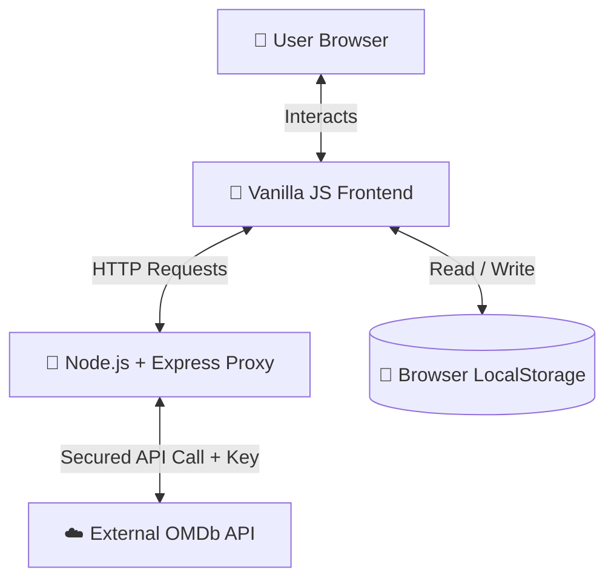

# 🎬 CineScope

> **Your Lens Into the World of Movies** — A modern, full-stack movie discovery, review, and watchlist platform that enables users to search movies, explore detailed information, submit ratings & reviews, and manage personalized watchlists through secure API integration.

[](LICENSE)
[](https://nodejs.org/)
[](https://expressjs.com/)
[](https://www.omdbapi.com/)

---

## 🔗 Demo Links & Resources
* ⚡ **Live Frontend Demo:** [Link](https://cinescope-worldofmovies.netlify.app/)
* 🌐 **Live Backend Proxy:** [Link](https://cinescope-7k1y.onrender.com)

---

## 📌 Problem Statement
In the digital era, movie enthusiasts often struggle with scattered movie data, cluttered interfaces, or platforms that require immediate signups just to browse and track movies. Existing mainstream solutions are often overwhelming, loaded with advertisements, and demanding on system resources. 

**CineScope** was built to solve this by providing a lightweight, cinematic, and clutter-free interface. It offers high-performance movie searches, seamless review collection, and private watchlist curation without requiring complex user onboarding, serving as a clean utility for casual viewers.

---

## ✨ Key Features
| Feature | Description | Technical / User Benefit |
| :--- | :--- | :--- |
| **🔎 Movie Search** | Query titles instantly using OMDb's registry. | High-speed, dynamic results display. |
| **📖 Detailed Modals** | Explores director, cast, plot, genre, and poster information inside a single-page modal. | Minimizes page reloads, keeping user context intact. |
| **⭐ Ratings & Reviews** | Submit local star-ratings and detailed text feedback per film. | Encourages interactive engagement and expression. |
| **📌 Personal Watchlist** | Bookmark movies to watch later via card clicks. | Keeps track of movies of interest in a dedicated panel. |
| **💾 Local Persistence** | Saves watchlist and reviews to client-side storage. | Data persists across browser sessions without a server database. |
| **📱 Responsive Design** | Clean cinematic theme adapting to desktop, tablet, and mobile displays. | Accessible and visually consistent on any screen size. |
| **🔐 Secure API Proxy** | Routes OMDb requests through an Express gateway backend. | Hides developer API keys from client-side network inspectors. |
| **⚠️ Error Handling** | Displays graceful UI fallbacks on query failures or network drops. | Prevents silent failures and ensures a reliable user experience. |

---

## 🏗️ Architecture Overview
CineScope separates concerns into a modular frontend and backend proxy architecture to prevent cross-origin issues and secure private environment credentials.

### System Flow


### Key Architectural Decisions:
1. **Express Reverse Proxy**: Direct client-to-OMDb API calls expose the sensitive API key in the browser network tab. Running an Express server handles key injection serverside.
2. **Hybrid Storage**: Volatile data (movie metadata) is fetched on demand, while personalized user states (watchlist and reviews) are stored locally in the browser's `localStorage` to eliminate db overhead.

---

## 🛠️ Tech Stack
| Category | Technologies |
| :--- | :--- |
| **Frontend** | HTML5, CSS3 (Custom Cinematic Red-Black-Gold Theme), Vanilla JavaScript (ES6+) |
| **Backend** | Node.js, Express.js, CORS, Dotenv, Node-Fetch |
| **API** | OMDb REST API |
| **Persistence** | Browser `localStorage` API |
| **Deployment** | Render (Backend), Static Web Hosting (Frontend) |

---

## 📂 Project Structure
```text
cinescope/
├── backend/
│   ├── .env                 # Environment variables (Git-ignored)
│   ├── package.json         # Backend dependencies & run scripts
│   └── server.js            # Express server & OMDb API proxy endpoints
├── frontend/
│   ├── index.html           # Main markup structure & modal layouts
│   ├── style.css            # Custom responsive layout styles (Cinematic theme)
│   └── script.js            # Frontend DOM operations & state management
├── README.md                # Project documentation
└── .gitignore               # Excludes node_modules and env secrets
```

### Major File Descriptions:
* **[server.js](backend/server.js)**: Runs the Express server, injects `OMDB_KEY` securely into query streams, and hosts CORS-compliant API endpoints.
* **[index.html](frontend/index.html)**: The single-page shell containing the search controls, dynamic movie grid placeholders, and details modal structure.
* **[script.js](frontend/script.js)**: Coordinates asynchronous backend fetches, renders cards dynamically, opens detail modals, and manages LocalStorage read/writes.
* **[style.css](frontend/style.css)**: Implements grid layouts, transitions, and hover animations, built on top of a customized red, dark-gray, and gold palette.

---

## 🔌 API Integration & Security
CineScope interacts with the external **OMDb API** through a customized backend middleware proxy.

### Endpoint Mapping:
1. **Search Endpoint**: `/search?q={query}`
   * Maps to `https://www.omdbapi.com/?apikey=${OMDB_KEY}&s={query}`
   * Returns a list of matching movies.
2. **Details Endpoint**: `/details/:id`
   * Maps to `https://www.omdbapi.com/?apikey=${OMDB_KEY}&i={id}&plot=full`
   * Obtains comprehensive metadata for a specific IMDb reference ID.

### Security Implementation:
To prevent API abuse and usage quota exhaustion:
* The client makes requests directly to the proxy (e.g., `https://cinescope-7k1y.onrender.com/search?q=Batman`).
* The proxy server reads the `OMDB_KEY` from serverside environment variables (`process.env.OMDB_KEY`), constructs the secure external request, executes it, and sends the sanitized JSON back to the client.
* Standard `cors` middleware restricts unauthorized client origins from spamming the endpoints.

---

## 💡 Implementation Highlights
### 1. Secure API Proxy Routing
The Node.js proxy server guarantees that private keys remain concealed, resolving CORS policies elegantly:
```javascript
app.get("/search", async (req, res) => {
  const query = req.query.q;
  try {
    const response = await fetch(`https://www.omdbapi.com/?apikey=${process.env.OMDB_KEY}&s=${query}`);
    const data = await response.json();
    res.json(data);
  } catch (err) {
    res.status(500).json({ error: "Error fetching data" });
  }
});
```

### 2. Client-Side State Synchronization
Rather than relying on a complex external state library, local storage values are synchronized directly upon interaction:
```javascript
function addToWatchlist(movie) {
  let watchlist = JSON.parse(localStorage.getItem(WATCHLIST_KEY)) || [];
  if (!watchlist.find((m) => m.imdbID === movie.imdbID)) {
    watchlist.push(movie);
    localStorage.setItem(WATCHLIST_KEY, JSON.stringify(watchlist));
    loadWatchlist();
  }
}
```

### 3. DOM Event Management & Modals
The movie details modal registers event listener handlers dynamically for form submissions, ensuring clean updates:
```javascript
reviewForm.onsubmit = (e) => {
  e.preventDefault();
  const rating = document.getElementById("rating").value;
  const reviewText = document.getElementById("reviewText").value;
  saveReview(id, rating, reviewText);
  loadReviews(id);
  reviewForm.reset();
};
```

---

## 💻 Local Development Setup
Follow these steps to set up and run CineScope on your local environment.

### Prerequisites
* **Node.js** (v16.0.0 or higher recommended)
* **npm** (comes packaged with Node.js)
* **OMDb API Key** (Request a free or developer key from [omdbapi.com](https://www.omdbapi.com/))

### Installation & Run Steps
1. **Clone the Repository:**
   ```bash
   git clone https://github.com/Shafia-01/CineScope.git
   cd CineScope
   ```

2. **Configure & Run Backend Server:**
   ```bash
   cd backend
   npm install
   ```
   Create a `.env` file in the `backend/` directory:
   ```env
   PORT=3000
   OMDB_KEY=your_omdb_api_key_here
   ```
   Launch the development server:
   ```bash
   npm start
   # or: node server.js
   ```
   Verify the server is running at `http://localhost:3000/search?q=Interstellar`

3. **Configure & Run Frontend Client:**
   * Navigate to the `frontend/` directory.
   * Configure the base API URL at the top of `script.js` to point to local server:
     ```javascript
     const API_BASE = "http://localhost:3000";
     ```
   * Open `frontend/index.html` in your browser (either double-click or use VS Code Live Server at `http://127.0.0.1:5500`).

---

## 📸 Screenshots
### 🖥️ Home Page & Search Results


### 🍿 Search Query Results


### 🎬 Movie Details Modal


---

## 🛡️ Challenges & Learnings
* **CORS Policies and API Secrets**: Initially, fetching directly from the browser exposed API keys inside network payloads and threw CORS validation errors. Building the Node.js/Express proxy solved both: securing the credentials server-side and automatically attaching access headers.
* **Efficient UI State Lifecycle**: With multiple interactive features (reviews, lists, modal transitions), preventing DOM layout thrashing was crucial. We leveraged targeted event delegations and custom modular rendering methods (`createMovieCard`) to construct elements incrementally.
* **Edge Case Handling (N/A Values)**: Many OMDb database entries lack posters or plot details. To maintain UI symmetry, we built fallback conditions (such as fallbacks to local asset placeholder images) when fields returned `"N/A"`.

---

## 🚀 Future Improvements
* **🔑 User Authentication**: Integrate JWT-based token authentication to support personalized user logins and private profiles.
* **☁️ Database Integration**: Migrate client-side LocalStorage to a persistent cloud database (e.g., MongoDB or PostgreSQL) for cross-device synchronization.
* **🎯 Recommendation Engine**: Implement a basic content-filtering recommendation engine based on user ratings and genres.
* **📢 Social Sharing**: Enable users to share their watchlist or movie reviews directly to social platforms or via unique URLs.

---

## 📄 Key Technical Takeaways
* **Full-Stack Architecture**: Built a movie discovery platform utilizing HTML5, CSS3, Vanilla JS, and an Express.js backend.
* **Secure API Gateway**: Designed and deployed a Node.js proxy to route OMDb API calls, preventing client-side API key leakage and bypassing CORS constraints.
* **Persistent States**: Implemented user reviews and watchlists using local storage persistence, reducing server overhead.
* **Responsive Layouts**: Designed a custom cinematic, mobile-responsive theme from scratch using pure CSS Grid and Flexbox.
* **Error Tolerant Flows**: Coded defensive conditions to handle API network timeouts, query failures, and missing properties gracefully.

---

## 📝 License
This project is licensed under the [MIT License](LICENSE) - see the LICENSE file for details.